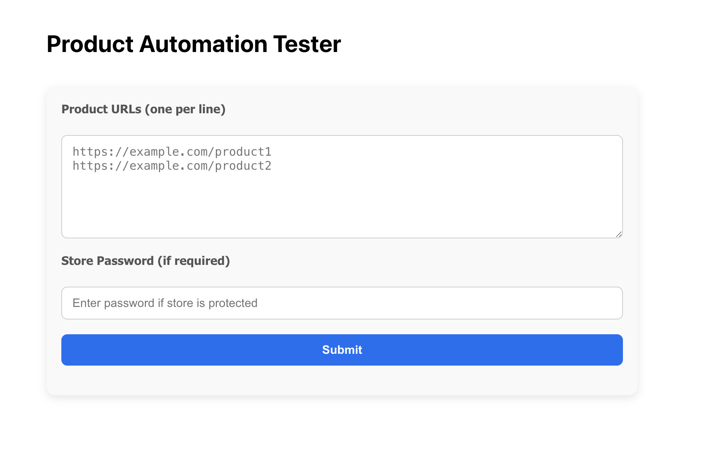
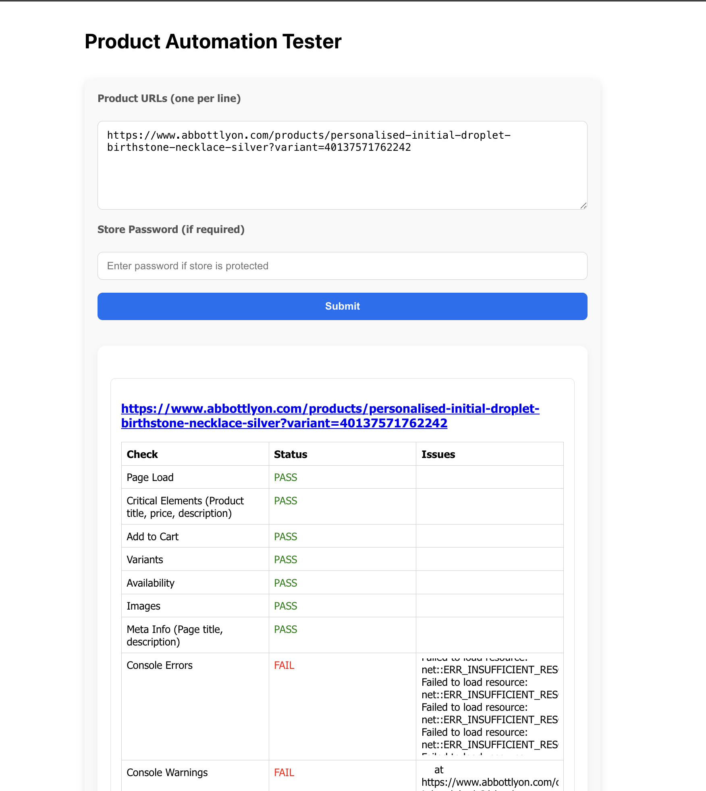

# E-Commerce Test Automation

Automated testing framework for e-commerce product pages. The framework checks critical product page elements, product variants, images, add-to-cart functionality, console errors, network issues, and overall page health.

---

## Features

- **Page Load Validation** – Ensures the product page loads correctly.  
- **Critical Element Checks** – Validates presence of title, description, price, and other key elements.  
- **Add to Cart Button Validation** – Checks if the "Add to Cart" button exists and is enabled.  
- **Product Variant Checks** – Detects available variants (size, color) and their availability.  
- **Product Availability** – Confirms if the product is in stock or sold out.  
- **Meta Information Validation** – Validates meta title, description, and SEO tags.  
- **Product Image Validation** – Checks primary and gallery images, alt-text, dimensions, broken images.  
- **Console & Network Error Capture** – Detects JS console errors, failed network requests, CORS issues, third-party script failures, security issues, and performance warnings.  

---

## Approach

The tool uses **Playwright** for browser automation. For each product URL, the framework:

1. Opens the page (handles password-protected pages if required).  
2. Validates page load and critical elements.  
3. Detects and validates product variants dynamically.  
4. Checks add-to-cart button and product availability.  
5. Captures console errors, network failures, and third-party script issues.  
6. Validates images: ensures proper loading, alt-text, and dimensions.  
7. Generates a JSON report capturing pass/fail status for each check.

**Trade-offs:**  

- Designed for **Shopify-like pages**; highly customized stores may require additional selectors.  
- Image validation uses lazy-loading detection, which may increase execution time.  
- Network and console error detection captures all errors, including non-critical third-party scripts.

---

## Prerequisites

- Node.js
- Yarn or npm  
- Chromium/Firefox/WebKit (Playwright bundled)  

---

## Cloud Execution

> You can use the cloud endpoint hosted on Vercel:

URL: https://ecom-test-automation.vercel.app/


**Steps to use:**

1. Enter a product URL in the input field.  
2. Click **Submit**.  
3. The service will return a full **JSON report** with the results.  

> **Note:** Product check may take up to **1 minute** due to full page validation.





## Setup & Local Execution

1. **Clone the repository**

```bash
git clone https://github.com/savan-gotrakiya/ecom-test-automation.git
cd ecom-test-automation
```

2. **Install dependencies**

```bash
num install
or
yarn install
```

3. **Install Playwright browsers**

```bash
npx playwright install
```

4. **Build and start the backend**

```bash
yarn build
yarn start
```

5. **Test the API**

-> You can send a POST request with product URLs to the local endpoint:

```bash
curl --location 'http://localhost:4000/api/runProductChecks' \
--header 'Content-Type: application/json' \
--data '{
  "urls": [
    "https://www.abbottlyon.com/products/personalised-initial-droplet-birthstone-necklace-silver?variant=40137571762242"
  ]
}'
```

> The API will return a JSON report similar to the Sample Test Report described below.
> Note: Execution may take up to 1 minute per product page.

---
## Sample Test Report

```json [
  {
    "url": "https://4t1qab-ka.myshopify.com/products/samsung-galaxy-f16-5g-vibing-blue-128-gb-6-gb-ram?variant=4504101978131790",
    "pageLoad": {
      "status": "PASS",
      "issues": []
    },
    "elements": {
      "status": "PASS",
      "issues": []
    },
    "addToCartBtn": {
      "status": "PASS",
      "issues": []
    },
    "variants": {
      "status": "PASS",
      "issues": [],
      "variants": [
        "Beige",
        "Black",
        "Bronze"
      ]
    },
    "availability": {
      "status": "PASS"
    },
    "metaInfo": {
      "status": "PASS",
      "issues": []
    },
    "image": {
      "status": "PASS",
      "issues": [],
      "images": [
        {
          "src": "//4t1qab-ka.myshopify.com/cdn/shop/files/FJVYfarWYAECQ-Y-photoutils.com_ee24fe25-b175-4287-a357-6e7fcc05eb87.webp?v=1756141644&width=3840",
          "alt": "Samsung Galaxy F16 5G (Vibing Blue, 128 GB)  (6 GB RAM)",
          "srcset": "//4t1qab-ka.myshopify.com/cdn/shop/files/FJVYfarWYAECQ-Y-photoutils.com_ee24fe25-b175-4287-a357-6e7fcc05eb87.webp?v=1756141644&width=240 240w, //4t1qab-ka.myshopify.com/cdn/shop/files/FJVYfarWYAECQ-Y-photoutils.com_ee24fe25-b175-4287-a357-6e7fcc05eb87.webp?v=1756141644&width=352 352w, //4t1qab-ka.myshopify.com/cdn/shop/files/FJVYfarWYAECQ-Y-photoutils.com_ee24fe25-b175-4287-a357-6e7fcc05eb87.webp?v=1756141644&width=832 832w, //4t1qab-ka.myshopify.com/cdn/shop/files/FJVYfarWYAECQ-Y-photoutils.com_ee24fe25-b175-4287-a357-6e7fcc05eb87.webp?v=1756141644&width=1200 1200w, //4t1qab-ka.myshopify.com/cdn/shop/files/FJVYfarWYAECQ-Y-photoutils.com_ee24fe25-b175-4287-a357-6e7fcc05eb87.webp?v=1756141644&width=1600 1600w, //4t1qab-ka.myshopify.com/cdn/shop/files/FJVYfarWYAECQ-Y-photoutils.com_ee24fe25-b175-4287-a357-6e7fcc05eb87.webp?v=1756141644&width=1920 1920w, //4t1qab-ka.myshopify.com/cdn/shop/files/FJVYfarWYAECQ-Y-photoutils.com_ee24fe25-b175-4287-a357-6e7fcc05eb87.webp?v=1756141644&width=2560 2560w, //4t1qab-ka.myshopify.com/cdn/shop/files/FJVYfarWYAECQ-Y-photoutils.com_ee24fe25-b175-4287-a357-6e7fcc05eb87.webp?v=1756141644&width=3840 3840w",
          "width": 637,
          "height": 418
        }
      ]
    }
  }
]```